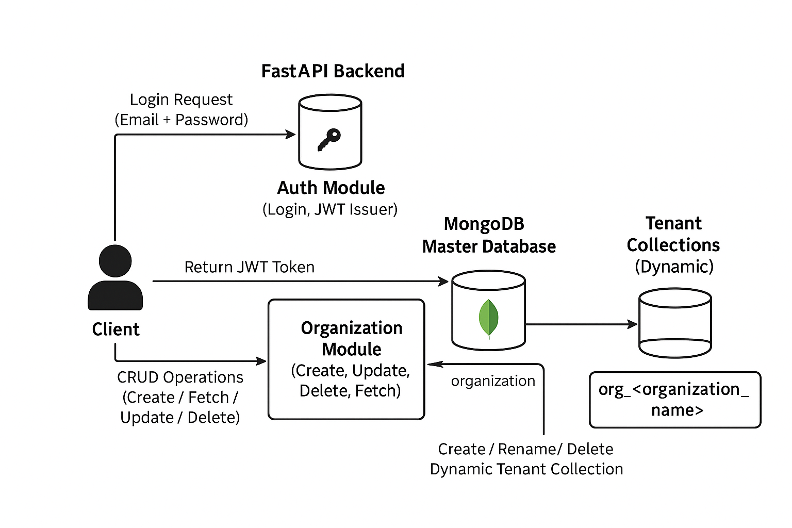

# Organization Management Service (Backend Intern Assignment)

# **System Architecture Overview**

### **Architecture Diagram**
<p align="center">
  
</p>

The architecture below illustrates how the Organization Management Service operates internally.  
It shows the complete workflow—from user login, token generation, and organization-level CRUD operations to the creation and management of organization-specific collections inside MongoDB.

The diagram highlights the separation between:

- **FastAPI Backend Modules** (Auth, Organization, Utility Modules)  
- **Master Database** (stores admin login details and organization metadata)  
- **Organization-Specific Collections** (each organization gets its own dynamically created collection)  
- **Data Flow** during login, JWT creation, organization creation, renaming, and deletion  

This provides a clear visualization of how the system maintains isolation between organizations while using a shared master database for authentication and overall metadata management.

Below diagrams describe how the organization management backend works using **FastAPI + MongoDB**.

<p align="center">
  
</p>


---

# **Overview**

FastAPI backend to **create and manage organizations** in a multi-organization architecture using **MongoDB**.

- **Master Database** – Stores organization metadata and admin credentials  
- **Organization Collections** – Each organization gets its own dynamic collection named `org_<organization_name>`  
- **Authentication** – JWT-based secure admin login  

---


## Folder Structure
```

organization-management/
│
├─ app/
│  ├─ pycache/              # Python cache
│  ├─ init.py
│  ├─ auth.py               # JWT-based authentication
│  ├─ db.py                 # MongoDB connection (Master DB)
│  ├─ main.py               # FastAPI app and endpoints
│  ├─ models.py             # Pydantic models for DB schemas
│  ├─ schemas.py            # Request/Response schemas
│  └─ utils.py              # Utility functions (password hashing, JWT etc.)
│
├─ README.md
├─ requirements.txt
└─ .env.example             # Example environment variables

````

---

## Requirements
- Python 3.9+
- MongoDB (local or URI-accessible)
- pip dependencies: `fastapi`, `pydantic`, `pymongo`, `python-jose`, `passlib[bcrypt]`, `uvicorn`

---

## Setup

1. Clone the repository:
```bash
git clone  https://github.com/dhiraj-rathod-dev/Organization-Management_The_Wedding_Company_assignment.git
cd organization-management
````

2. Create a virtual environment:

```bash
python -m venv venv
source venv/bin/activate      # Linux/Mac
venv\Scripts\activate         # Windows
```

3. Install dependencies:

```bash
pip install -r requirements.txt
```

4. Setup environment variables (copy `.env.example` to `.env`):

```
MONGO_URI=""
MASTER_DB=master_db
JWT_SECRET=your-secret
JWT_ALGORITHM=HS256
JWT_EXPIRES_SECONDS=3600
```

5. Run FastAPI server:

```bash
uvicorn app.main:app --reload --port 8000
```
Server will run at:
👉 [http://localhost:8000](http://localhost:8000)
Docs:(
👉 [http://localhost:8000/docs](http://localhost:8000/docs)(swagger ui for api testing)

---

---

## API Operations

| Operation           | Endpoint                 | Method | Description                                                                       |
| ------------------- | ------------------------ | ------ | --------------------------------------------------------------------------------- |
| Create Organization | `/org/create`            | POST   | Creates a new org, stores metadata in master DB, creates `org_<name>` collection. |
| Admin Login         | `/admin/login`           | POST   | Authenticates admin, returns JWT token.                                           |
| Get Organization    | `/org/{org_name}`        | GET    | Fetch organization metadata.                                                      |
| Update Organization | `/org/update/{org_name}` | PUT    | Update org name; renames tenant collection.                                       |
| Delete Organization | `/org/delete/{org_name}` | DELETE | Removes org metadata and tenant collection.                                       |


## **🧪 Testing Workflow (Step-by-Step)**

### **1. Create Organization**

```bash
URL: POST http://127.0.0.1:8000/org/create
Request Body:
 {
  "organization_name": "dhirajrathod",
  "email": "dhirajrathod@gmail.com",
  "password": "Admin123"
}


```

### **2. Admin Login**

```bash
URL: POST http://127.0.0.1:8000/admin/login
Request Body:
{
  "email": "dhirajrathod@gmail.com",
  "password": "Admin123"
}


```

---

### **3. Fetch Organization**

```bash
URL: GET http://127.0.0.1:8000/auth/check
OUTPUT:-
Headers:Authorization: Bearer <your_token_here>

```

---

### **4. Update Organization Name**

```bash
URL: PUT http://127.0.0.1:8000/org/update
Request Body:
{
  "old_organization_name": "dhirajrathod",
  "new_organization_name": "dhirajrathod2"
}

```

---

### **5. Delete Organization**

```bash
URL: DELETE http://127.0.0.1:8000/org/delete
Request Body:
{
  "organization_name": "dhirajrathod2"
}

```

---

## Design Notes, Scalability & Trade-offs

**Pros**

* Easy to implement.
* Quickly onboard new orgs (auto-create collection).
* Single DB simplifies backups.

**Cons**

* Many collections → hard to manage at very large scale.
* Noisy neighbor problem (one heavy tenant affects others).
* Harder to scale per-tenant workloads.

**Alternatives for larger scale**

1. **Shared collection with `tenant_id`**: Handles thousands of tenants efficiently.
2. **Separate databases per tenant**: Strong isolation and easy backup/restore.
3. **Sharding / Replica Sets**: For high throughput and availability.
4. **Hybrid approach**: Small tenants share collection, large tenants get dedicated DB.

**Best practice for production**

* Use HTTPS & strong JWT secrets.
* Input sanitization (`organization_name`) to avoid injection.
* Rotate JWT, add logging, rate limiting.
* Add automated tests and containerize (Docker).

---

## Testing Flow

1. Start MongoDB.
2. Start FastAPI: `uvicorn app.main:app --reload`.
3. **Create Organization** → Check `organizations` in master DB.
4. **Admin Login** → Get JWT token.
5. **Get/Update/Delete Org** → Perform actions with JWT auth.

---

## Optional Enhancements

* Convert to **async** using **Motor** for non-blocking DB operations.
* Add **Dockerfile** & `docker-compose.yml` for MongoDB + FastAPI service.
* Add **unit tests** with `pytest` & GitHub Actions CI workflow.

---

---

